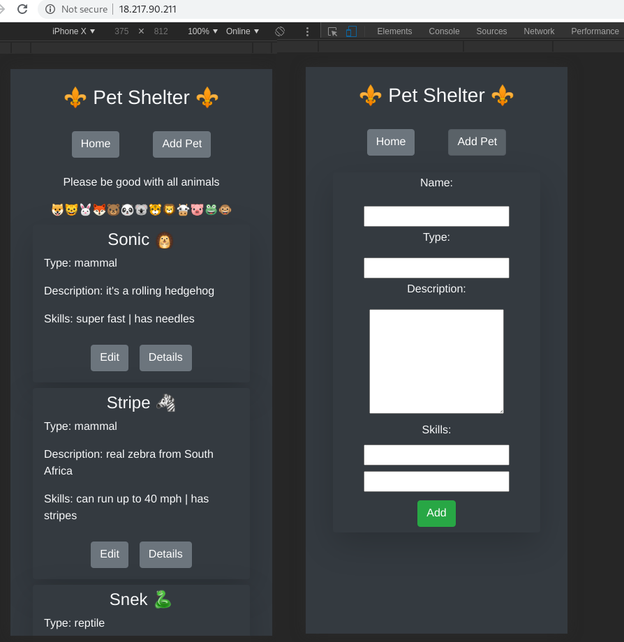

# "Pet shelter" MERN exam project
# 🐶🐱🐰🦊🐻🐼🐨🐯🦁🐮🐷🐸🐵
"Pet shelter" is ReactJS ⚛️ app, which allows user add animals to shelter db, and change their properties later. This is phone friendly app. 

# Deployed with AWS ✅
http://18.217.90.211/

## Technology used 
- Front end: ReactJS, @reach/router, axios, bootstrap
- Back end: NodeJS, express, cors, nodemon
- MongoDB: mongoose
- AWS

## install: 
```
npm i #to download server dependencies
cd client 
npm i #to download client dependencies
cd ..
npm start
#open new termial window
cd client 
npm start
```

## Screenshot


## author:
IURII LYTVYN
